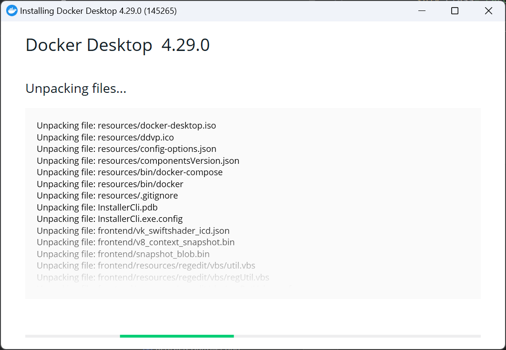
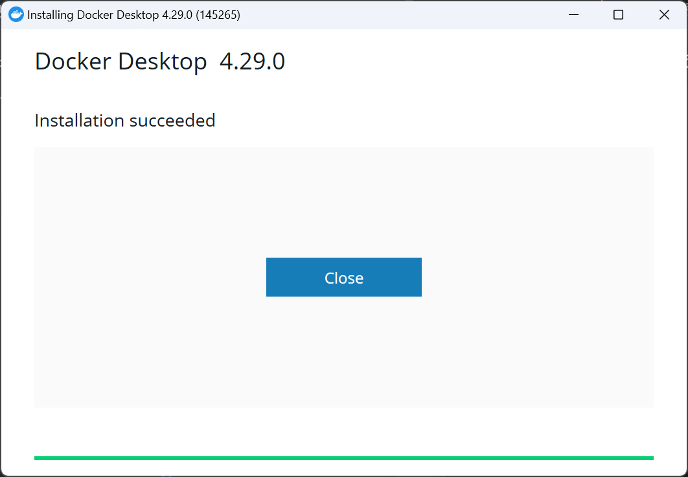
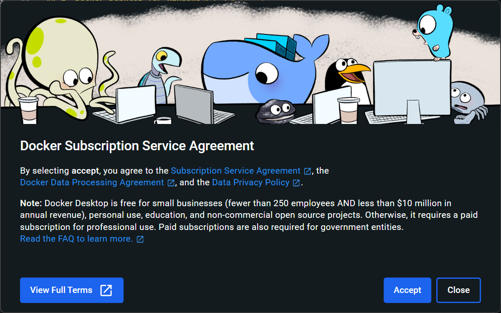
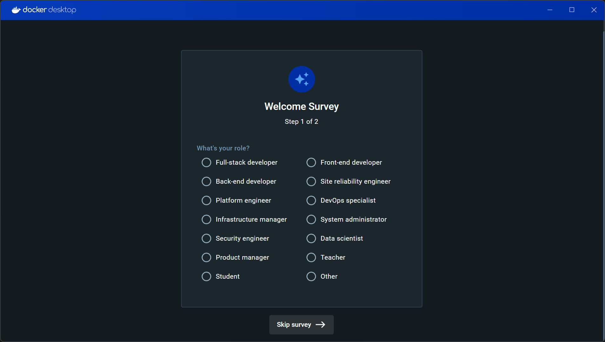
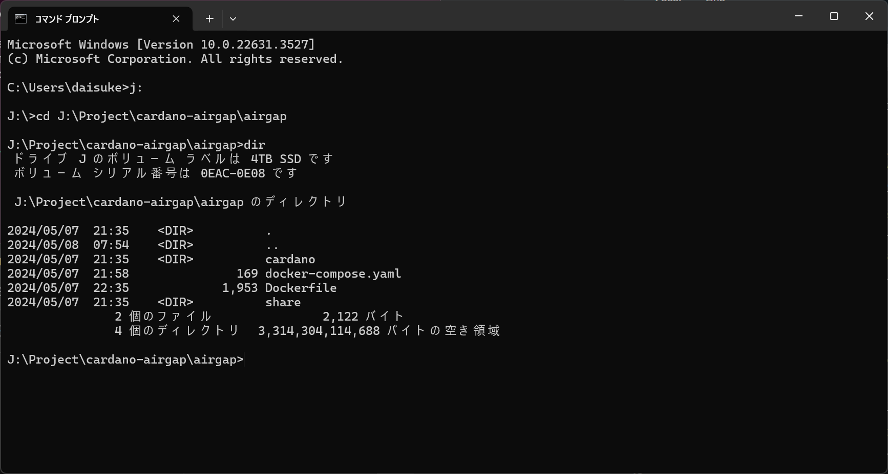
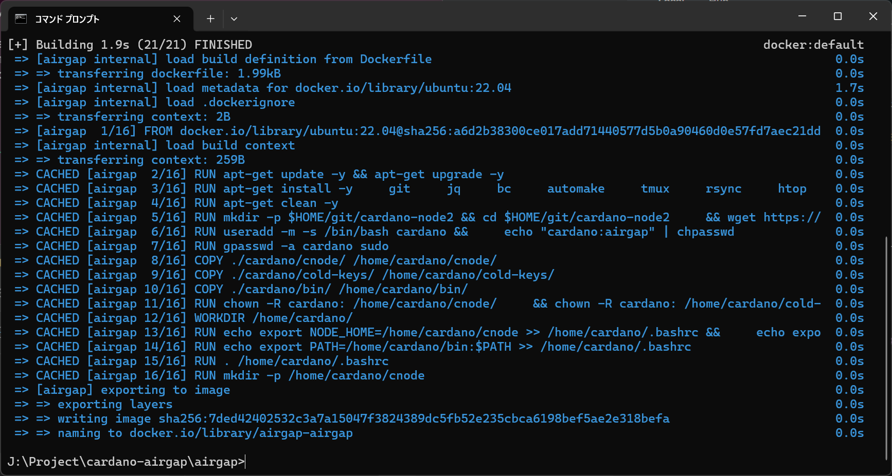
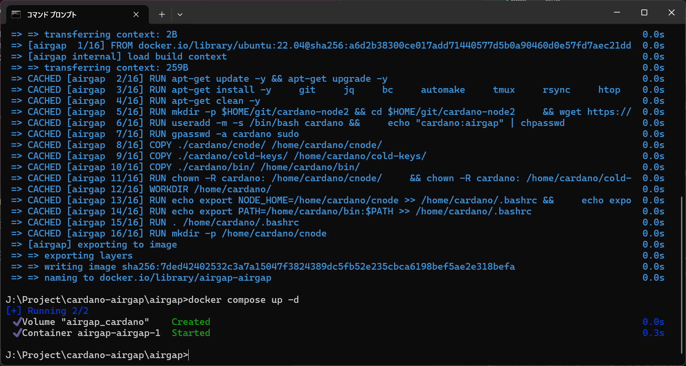
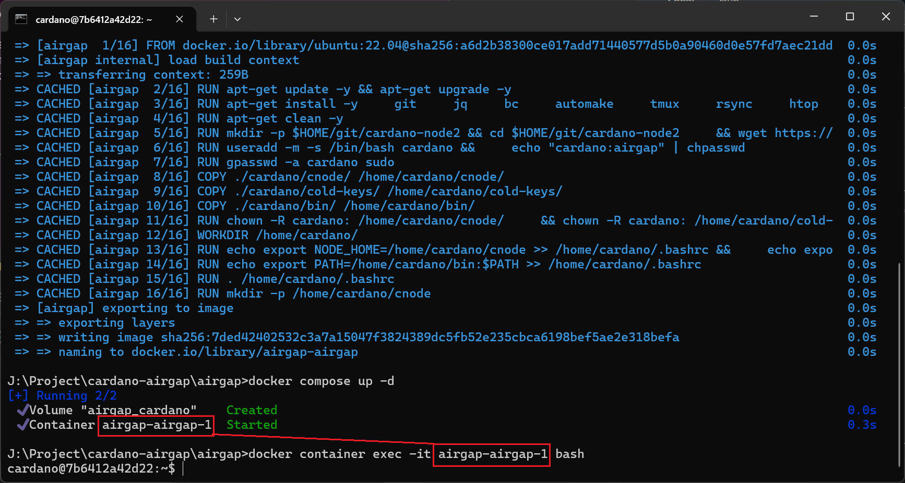
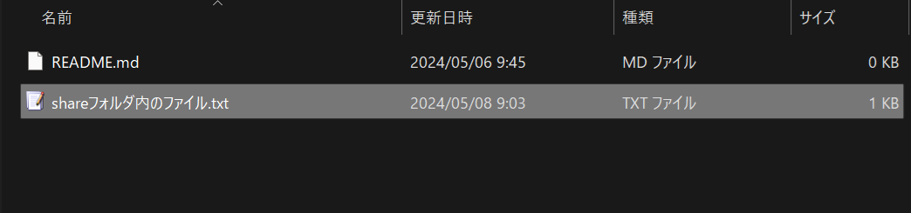
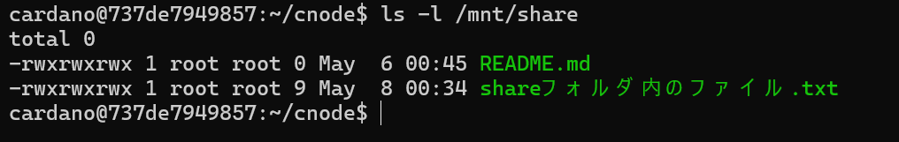

# Windows環境でのDockerのセットアップ

### 環境
- Windows 11 Pro

### ダウンロード/インストール
- Docker Desktop for Windows

---

## 1- Docker Desktop for Windowsのダウンロード

### 1-1. 以下のリンク先からDocker Desktopをインストールします

| リンク | ファイル名 |
| --- | --- |
| [https://www.docker.com/ja-jp/products/docker-desktop/](https://www.docker.com/ja-jp/products/docker-desktop/) | Docker Desktop Installer.exe |

> ダウンロードファイルは500MB程あります


---

### 1-2. ダウンロードしたファイルをクリック、インストール画面に従ってインストールし、完了したら「Close」をクリックして終了します。

1. 環境によってチェックボックスの数が異なるかもしれませんが、問題ありません


2. 以下のようにインストールが実行されます


3. この画面までくればインストールは完了です


4. 念のため Windows を再起動します

---

### 1-3. スタートメニューから Docker Desktop を起動し、以下の問いに回答します。

1. Accept をクリックします


2. 質問に回答するか、Skip Survery → をクリックします



---

# 2- Dockerイメージのビルド

### 2-1. Docker の定義ファイルをダウンロードし解凍します。


[https://github.com/edaisuke/cardano-airgap-for-windows](https://github.com/edaisuke/cardano-airgap-for-windows)

---

### 2-2. コマンドプロンプトまたはターミナルを起動し、解凍したフォルダに移動します。

> 下記ディレクトリとファイルが存在することを確認してください。
- cardano/
- cardano/bin/
- cardano/cnode/
- cardano/cold-keys/
- docker-compose.yaml
- Dockerfile
- share/




---

### 2-3. Docker イメージをビルドします。

> 初回ビルドはセキュリティパッチなどを適用するため、5分ほど時間がかかります。

```shell
docker compose build
```



> エラーなど出ず終了すればビルドは成功です！！


---


### 2-4. Docker コンテナを起動します。

そのまま続けて以下のコマンドを入力すると、Docker コンテナが起動します。

```shell
docker compose up -d
```




---

# 3- Dockerコンテナ内で各種コマンドを実行する。

### 3-1. Docker コンテナ内に入る

コンテナに入るにはコンテナ名を知る必要があります。

```
docker container exec -it <コンテナ名> bash
```

下記画像のように `docker compose up -d` の戻り値に、

> Container <ins>airgap-airgap-1</ins>  Started

と出力されています。この下線を引いた部分がコンテナ名となります。
したがって、今回の場合以下のようなコマンドを実行するとコンテナ内に入る事ができます。

```
docker container exec -it airgap-airgap-1 bash
```



> 入れました！

---

### 3-2. cardano-cliのバージョンを確認してみる

Dockerビルドの段階でcardano-cliが自動的にダウンロードされインストールされていますので、確認をしてみましょう！

```
cardano-cli version
```


---

### 3-2. 制限事項

セキュリティ向上のためかなりキツく制限をかけています。

- ネットワークには繋がらない設定になっています
- sudoは使えません
- 必要最低限のコマンドのみ使用可能です

---

### 3-3. 共有フォルダ

コマンドプロンプトなどで開いているフォルダ内にある `share` フォルダと、Dockerコンテナ内の `/mnt/share` フォルダが共有フォルダとして設定されています。ファイルのやり取りはこのフォルダを使用してください。




---

# 4- Docker コンテナの操作

### 4-1. Dockerコンテナ内から抜ける

```shell
exit
```

---

### 4-2. Dockerコンテナを停止する

`docker-compose.yaml` や `Dockerfile` があるフォルダで以下を実行する。

```shell
docker compose down
```

---

### 4-3. 再度Dockerコンテナを起動する

`docker-compose.yaml` や `Dockerfile` があるフォルダで以下を実行する。

```shell
docker compose up -d
```
